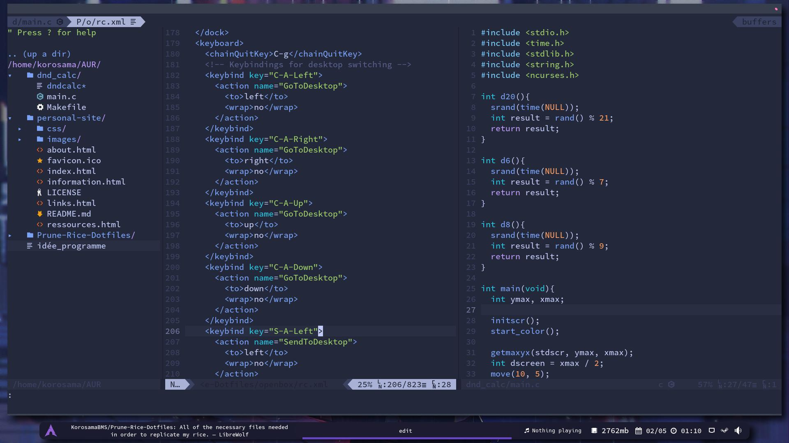
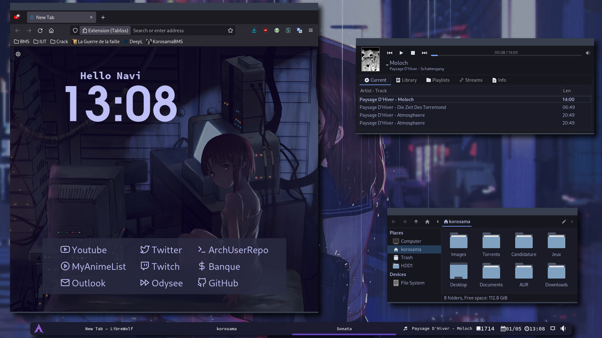

# Prune-Rice-Dotfiles
All of the necessary files needed in order to replicate my rice. 
 

-----------------------
**Software used :**
* Openbox
* Tint2
* Librewolf + Tabliss
* Neovim
* Kitty 
* Rofi

-----------------------

 

 

----------------------
* Feel free to reach out if you need help
* Advice is apreciated 
* Do whatever you want with it, it's FOSS
